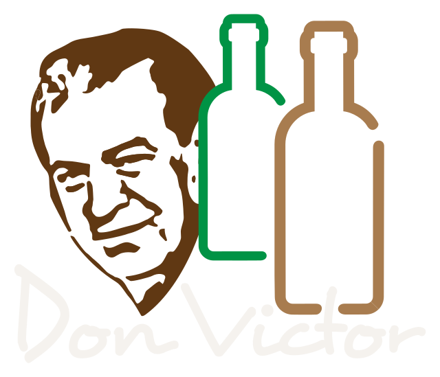

<div align="center">
<br/>

# Licores Don Víctor


<br/>


</div>

---

## 🍾 Sobre el proyecto

**Licores Don Víctor** es el catálogo digital de una licorera ubicada en
**La Fortuna, San Carlos, Costa Rica**. El sitio muestra el inventario de
cervezas, vinos, licores y más, organizado por categorías, con fichas de
producto detalladas — todo pensado para que el cliente decida rápido y
complete la compra por **WhatsApp**, sin carritos ni checkouts online.

> 📍 Un negocio local, con presencia digital moderna y una experiencia de
> compra simple y directa.

## ✨ Características

- 🛍️ **Catálogo por categorías** — cervezas, vinos, licores, cristalería y más, con imágenes y filtros.
- 🔍 **Fichas de producto** con detalle, precio y disponibilidad.
- ⭐ **Productos destacados y en promoción** resaltados en la página de inicio.
- 💬 **Conversión por WhatsApp** — un clic para consultar o pedir, sin fricción de un checkout tradicional.
- 🔐 **Panel administrativo privado** para gestionar productos y categorías (altas, ediciones, imágenes) sin tocar código.
- 📱 **Diseño responsive**, pensado para clientes que navegan desde el celular.
- ⚡ **Carga rápida** — sitio ligero, sin frameworks pesados ni pasos de compilación.

## 🧱 Stack tecnológico

| Capa | Tecnología |
|---|---|
| Frontend | HTML5, CSS3, JavaScript |
| Backend / Datos | [Supabase](https://supabase.com) (Postgres, Auth, Storage) |
| Hosting | [Vercel](https://vercel.com) |
| Conversión | WhatsApp |

## 🗂️ Estructura del proyecto

```
public/
 ├── index.html          Página de inicio
 ├── catalogo.html        Catálogo general
 ├── categorias.html      Vista por categoría
 ├── contacto.html         Contacto
 ├── nosotros.html          Sobre nosotros
 ├── admin/                  Panel administrativo (privado)
 └── img/                     Imágenes del sitio y de producto

supabase/                Esquema de base de datos, seguridad y datos
```

## 📸 Vista previa

<div align="center">


</div>

---

<div align="center">

Hecho con 🥂 para **Licores Don Víctor** · La Fortuna, Costa Rica

</div>
